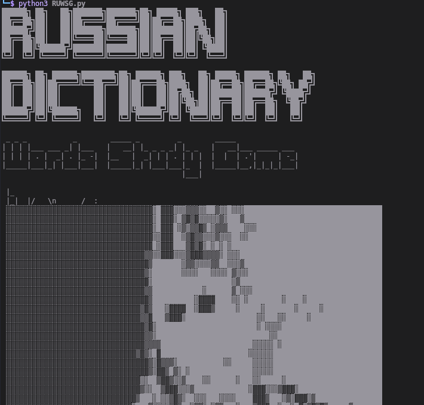
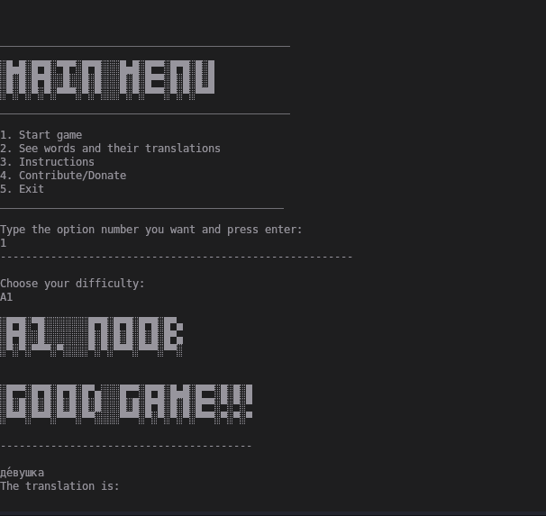
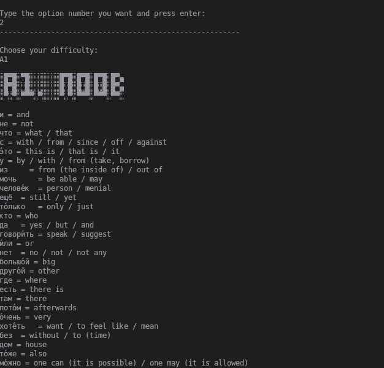

Hello! 

If you are on Linux OS, do a git clone of this repository.
> To open the program, open the terminal and specify the path to the files folder where you do the clone
> Now execute the program with the command:
  > pythton3 RUWSG.py

If you are on Windows OS, download the ZIP of this repository.
> To open the program is just execute the:
  >  RUWSG.exe

Soon i pretend to bring this program for portuguese language.

Screenshots of the program:

